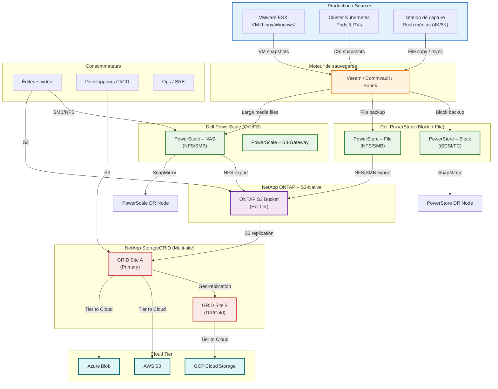

## 1. Vue d’ensemble (texte)

| Niveau | Fonction | Produit principale | Rôle dans le scénario |
|--------|----------|------------------------|-----------------------|
| **Ingestion / Production** | Capture de rushes vidéo, export de VM, snapshots Kubernetes | **Serveurs de capture / hyper‑visors / clusters K8s** | Source des données à protéger |
| **Sauvegarde primaire (on‑prem)** | Sauvegarde à chaud, dé‑duplication, réplication locale | **Dell PowerStore** (block + file) + **Dell PowerScale** (NAS scale‑out) | Stockage à haute performance pour les backups quotidiens (VM, bases, fichiers) |
| **Sau‑archivage objet (court‑terme)** | Accès fréquent aux gros fichiers média, partage d’équipes | **NetApp ONTAP S3‑Native** (déployé sur le même cluster PowerStore/PowerScale ou sur un petit AFF) | Bucket S3 « hot » → API S3, NFS/SMB en arrière‑plan |
| **Archive objet long‑terme** | Conservation de plusieurs années, conformité, tiering vers le cloud | **NetApp StorageGRID** (multi‑site) + **PowerScale OneFS S3‑Gateway** (optionnel) | Buckets S3 « cold » → réplication inter‑site, tiering vers Azure Blob / AWS S3 / GCP GCS |
| **Réduction / Tiering** | Dé‑duplication, compression, écriture sur SSD/NVMe, migration vers HDD ou Cloud | **PowerStore Data‑Reduction Engine** + **PowerScale OneFS SmartPools** + **StorageGRID Tiering** | Optimise le coût du stockage |
| **Or & Orchestration** | Orchestration des jobs, visibilité, reporting | **Veeam / NetBackup / Commvault** (ou **Rubrik**) + **NetApp ONTAP System Manager**, **PowerStore Manager**, **PowerScale System Manager**, **StorageGRID UI** | Planification, rétention, restauration |
| **Réplication / DR** | Copie asynchrone vers un site de secours (ou cloud) | **PowerStore SnapMirror**, **PowerScale SnapMirror**, **StorageGRID Geo‑Replication**, **VMware Site Recovery Manager** | RPO/RTO < 4 h (exemple) |
| **Accès aux sauveg** | Applications de post‑production, développeurs, équipes IT | **SMB/NFS** (PowerScale, PowerStore) + **S3 API** (ONTAP, StorageGRID) + **K8s CSI drivers** (PowerStore CSI, NetApp Trident) | Les/écriture directe depuis les postes ou les pods |

---

## 2. Schéma hypothétique (Mermaid)



### Légende du diagramme

| Couleur / Bloc | Signification |
|----------------|----------------|
| **Bleu clair (source)** | Serveurs de production (VMware, Kubernetes, stations de capture). |
| **Orange (backup engine)** | Logiciel de sauvegarde qui orchestre les snapshots, la dé‑duplication et le déplacement. |
| **Vert (stockage primaire)** | Stockage à haute performance (PowerStore Block + File, PowerScale NAS). |
| **Violet (S3 hot)** | Bucket S3 « hot » exposé par ONTAP S3‑Native (ou PowerScale S3‑Gateway). |
| **Rouge (S3 cold / archive)** | StorageGRID, réplication multi‑site, tiering vers le cloud. |
| **Cyan (cloud tier)** | Services cloud publics où les objets les plus anciens sont déplacés. |
| **Flèches** | Direction des données : ingestion → sauvegarde → stockage primaire → objet hot → archive cold → cloud. |

---

## 3. Parcours typiques de données (cas d’usage)

| Cas d’usage | Chemin de données | Pourquoi ce chemin |
|------------|-------------------|--------------------|
| **1️⃣ Sauvegarde VM VMware** | ESXi → Veeam → PowerStore Block (iSCSI/FC) → SnapMirror → PowerStore DR (site B) | Block‑level, RPO < 15 min, rép instantanée via SnapMirror. |
| **2️⃣ Sauvegarde de PV** | K8s CSI (Trident) → Veeam/Velero → PowerStore File (NFS) → PowerScale NAS (archivage) → ONTAP S3 (hot) → StorageGRID (cold) | Les PV sont des fichiers (NFS) ou des volumes block ; on profite de la dé‑duplication de PowerStore puis on expose les snapshots via S3 pour les pipelines CI/CD. |
| **3️⃣ Ingestion de rushes vidéo** | Station de capture → Veeam (ou script rsync) → PowerScale NAS (NFS) → ONTAP S3 (hot) → StorageGRID (cold) → Cloud (Azure Blob) | Les rushes sont volumineux (TB/Jour). PowerScale fournit le débit nécessaire 10 GbE/25 GbE). Le bucket S3 hot permet aux équipes de post‑production d’accéder via les outils qui consomment l’API S3 (Adobe). |
| **4️⃣ Archivage long terme** | ONTAP S3 (hot) → StorageGRID (geo‑replication) → Tiering → Cloud (AWS S3 IA, Azure Cool, GCP Nearline) | Conformité (WORM via Object Lock) + coût minimal. |
| **5️⃣ Restauration rapide** | Demande d’un fichier média ou d’une VM → Bucket S3 (hot) → PowerScale NAS (NFS) ou PowerStore File (SMB) → VM/Pod | Le hot tier garantit < 5 s d’accès, les snapshots restent permettent un rollback instantané. |
| **6️⃣ DR inter‑site** | PowerStore SnapMirror ↔ PowerStore DR + PowerScale SnapMirror ↔ PowerScale DR + StorageGRID Geo‑replication ↔ Site B | Tous les niveaux (block, file, object) sont répliqués, offrant un RPO de quelques heures et un RTO de < 2 h pour les gros jeux de données. |

---

## 4. Points d’attention (choix technologiques)

| Aspect | Décision | Justification |
|--------|----------|---------------|
| **Dé‑duplication** | Utiliser le **Data‑Reduction Engine** de PowerStore pour les blocs block et le **SmartPools** de PowerScale pour les fichiers médias. | Réduction de 5‑10 × sur les VM et les rushes similaires. |
| **Accès S3 natif** | **ONTAP S3‑Native** sur un petit cluster AFF (ou sur le même PowerStore) pour les workloads qui attendent une API S3 (CI/CD, analytics). | Pas besoin d’un gateway supplémentaire supplémentaire, performances SSD. |
| **Archive objet** | **StorageGRID** en mode **multi‑site** (2 sites, 1 primary + 1 DR) avec **tiering** vers le cloud. | Conformité (Object Lock), réplication géographique, coûts coût. |
| **Réseau** | Backbone **25 GbE** entre les nœuds PowerScale/PowerStore et les serveurs de capture. <br> **10 GbE** vers les appliances StorageGRID et le lien WAN site‑à‑site (IPSec/MPLS). | Garantit le débit nécessaire pour les rushes 8 K (≥ 30 GB/s). |
| **Sé des identités** | **LDAP/AD** centralisé + **IAM** (NetApp S3 IAM, PowerStore RBAC). | Contrôle d’accès unifié pour SMB/NFS/S3. |
| **Orchestration** | **Veeam** (ou **Commvault**) pour les VM & file‑level, **Velero** + **Trident** pour les PV K8s, **PowerStore/PowerScale SnapMirror** pour la réplication. | Couverture complète des workloads. |
| **Monitoring** | **NetApp OnCommand Insight**, **PowerStore Manager**, **PowerScale System Manager**, **Grafana/Prometheus** (via les API REST) + **SNMP** vers le NOC. | Visibilité en temps réel, alertes SLA. |
| **Sécurité** | **Encryption‑at‑rest** (AES‑256) sur PowerStore & PowerScale, **TLS 1.2+** sur les endpoints S3, **Object Lock** (WORM) sur StorageGRID. | Conformité GDPR, C‑, etc. |
| **Capacité estimée (exemple)** | • Rush médias : 200 TB/mois <br> • VM : 30 TB (dé‑dupliqués) <br> • K8s PV : 15 TB <br> **Total primaire** ≈ 300 TB (hot) → 5 PB (cold) après tiering. | Dimensionnement du cluster PowerScale (≈ 30 nodes 2 TB NVMe + 100 TB HDD) + PowerStore (≈ 10 nodes 4 TB NVMe + 200 TB HDD) + StorageGRID (2 sites 10 PB). |

---

## 5. Checklistumé de l’architecture « clé en main »

```
[Production] ──► [Backup Engine] ──► [PowerStore (Block/File)] ──►
      │                                 │
      └─► [PowerScale NAS] ──► [ONTAP S3‑Native (Hot)] ──► [StorageGRID (Cold)] ──► Cloud (Azure/AWS/GCP)
```

- **PowerStore** : sauvegarde à bloc (VM) + fichiers (scripts, bases).  
- **PowerScale** : débit haute capacité / débit pour les rushes médias.  
- **ONTAP S3‑Native** : bucket “hot” accessible par les équipes de post‑production et les pipelines CI/CD.  
- **StorageGRID** : archive géo‑répliquée, tiering vers le cloud, conformité WORM.  
- **Réplication** : SnapMirror (PowerStore/PowerScale) + Geo‑Replication (StorageGRID) → site DR.  
- **Accès** : SMB/NFS (PowerStore/PowerScale) **et** S3 (ONTAP + Grid) → tous (éditeurs, devs, ops).  

---

### 6. Prochaines étapes concr

1. **Faire un sizing détaillé** (débit vidéo, nombre de VM, RPO/RTO, rétention).  
2. **Dessiner le diagramme physique** (rack, interconnexions, VLAN, Qo).  
3. **Valider le contrat de support** (PowerScale Premier, PowerStore ProSupport, NetApp Premier).  
4. **Déployer un PoC** : <br>‑ PowerStore 8 nodes + PowerScale 4 nodes + ONTAP S3‑Native (AFF E‑Series) + StorageGRID 2 sites (sandbox). <br>‑ Exécuter des sauvegardes Veeam, Velero, ingestion de rushes.  
5. **Mettre en place le monitoring** (Grafana + Prometheus + OnCommand Insight).  
6. **Documenter les procédures d’upgrade** (OneFS 9.5→9.5.3, PowerStore 4.4→4.5, ONTAP 9.12, StorageGRID 7.1→7.2).  

---
